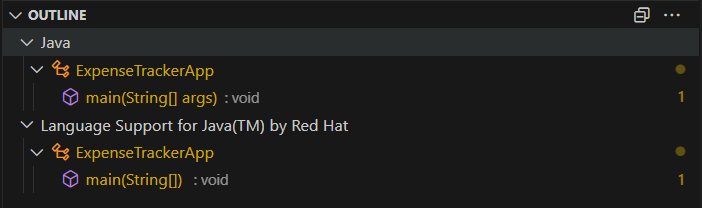
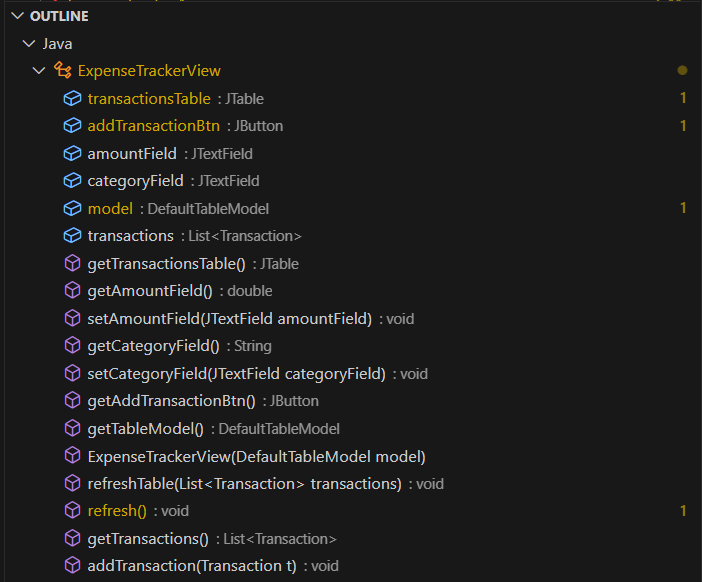
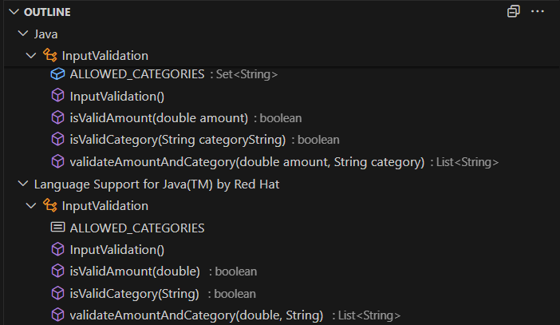
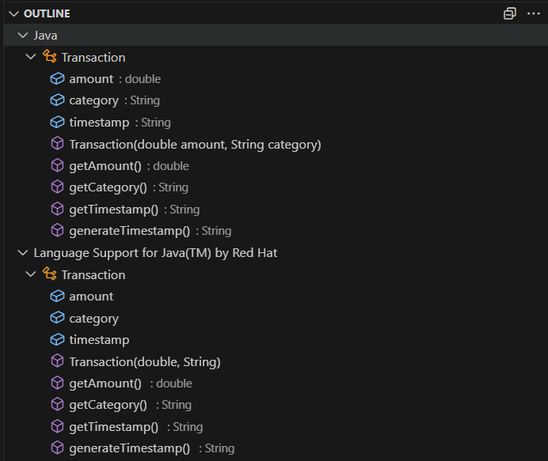

# hw1- Manual Review

The homework will be based on this project named "Expense Tracker",where users will be able to add/remove daily transaction. 

## How to build and test (from Terminal):
1. Make sure that you have Apache Ant installed. Run ```ant``` in the root directory, which contains the build.xml build file.

2. Run ```ant document``` to generate the jdoc folder. In that folder, open the index.html file.

3. Run ```ant compile``` to generate the class files. Compiled classes will be in the bin directory.

4. Run ```ant test``` to compile all unit tests and run them.

## How to run (from Terminal):
After building the project (i.e., running ant), run: ```java -cp bin ExpenseTrackerApp```

## How to clean up (from Terminal):
Run ```ant clean``` to clean the project (i.e., delete all generated files).

## Code Modification

Create a file named ```InputValidation.java```  to validate the ```amount``` and ```category``` field of this app. Some hints are as follows:
1. The ```amount``` should be greater than 0 and less than 1000. 
2. It should be a valid number. 
3. The ```category``` should be a valid string input from the following list: "food", "travel", "bills", "entertainment", "other" .
4. You should display error messages on the GUI and not accept the invalid input. . You should throw an appropriate exception. 
5. Update the ExpenseTrackerApp.java with the input validation steps for adding transaction.

## Manual Review
Here are some examples of satisfying ```non-functional`` requirements:
1. Understandability
• External documentation (such as a README file) improves program understanding. This app’s
README file helps users and developers by providing the build instructions.


Here are some examples of violating ```non-functional``` requirements:
1.  Modularity
• The app does not apply the MVC architecture pattern.
• The app should declare the following packages and their classes: model, view, controller. 

## Understandibility
Brief Explaination of the project:
# Expense Tracker (Swing, MVC-lite)

A small desktop app to add and view daily transactions.

### Features
- **Add transactions** with amount, category, and timestamp.
- **Table view** with auto-calculated **Total** row.
- **Input validation** (`InputValidation.java`)
  - `amount`: numeric, `0 < amount < 1000`
  - `category`: one of `food`, `travel`, `bills`, `entertainment`, `other`
- **Incremental updates** and clean error messages for invalid input.
- **Javadoc**: API documentation generated to the `jdoc/` folder.

### Code Layout
- `ExpenseTrackerApp.java` — app entry point; wires up UI and validation.
- `ExpenseTrackerView.java` — Swing UI and table rendering.
- `Transaction.java` — immutable transaction model.
- `InputValidation.java` — validation utilities.


### Running
Compile and run from the project root (no external deps):
```bash
javac *.java
java ExpenseTrackerApp
```

# Outline of All Java Classes
Note: All the screenshots are places under images/ folder.
### ExpenseTrackerApp


### ExpenseTrackerView


### InputValidation


### Transaction
